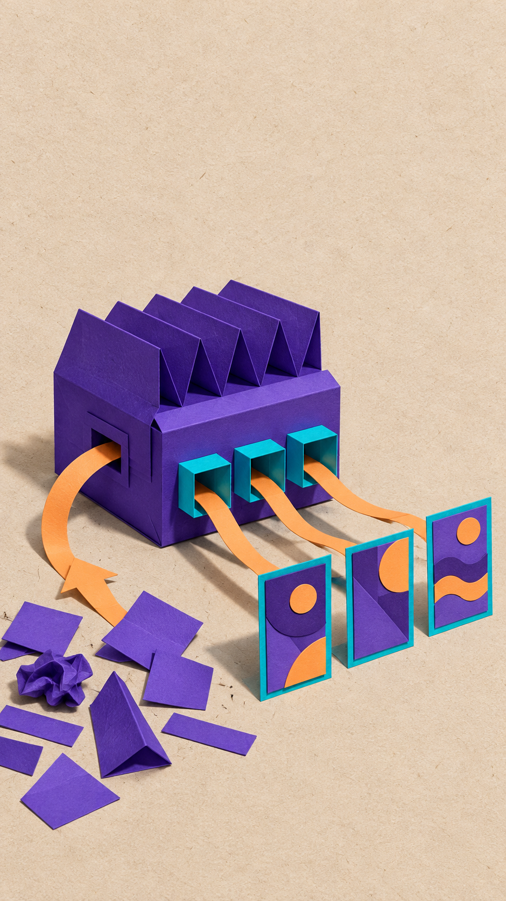
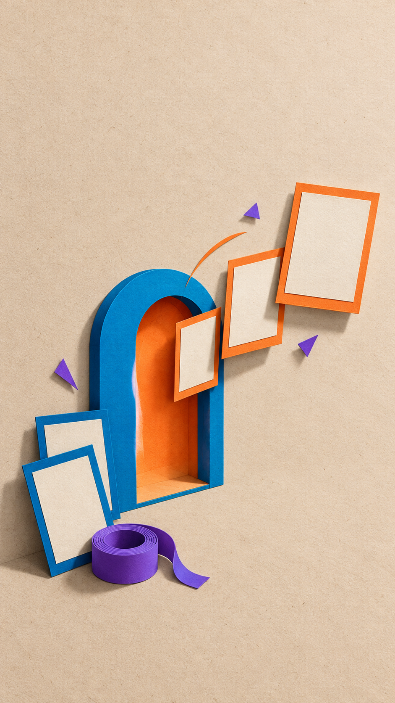

# eian-collage-broll

[English](README.md)

> 一套由创作者主导的编辑风半调纸拼贴 B-roll 工作流：把定稿口播转译为鲜明的视觉隐喻，并发展成可进入运动制作的素材包。

`eian-collage-broll` 是创意工作流，不是自动视频生成器。它把一段已经定稿的口播发展为有意图的完成态拼贴尾帧、可向其组装而成的首帧，以及完整物化的运动提示词。创作者在两次审批闸门中都保留最终审美判断。

## 它要守住什么

每个 item 都由四条创作原则约束：

1. **先意义，后图像。** 先从口播的含义和观众需要一眼理解的关系出发，而不是罗列一组泛泛好看的物件。
2. **先构图，后运动。** 在描述运动前，先建立完成态视觉关系、层级、配色、位置、呼吸区与组装顺序。
3. **创作者的判断始终属于创作者。** Gate 1 审批视觉命题；Gate 2 审批实际生成的完成态尾帧。候选选择、提示词草稿或自动检查均不能代替这两次判断。
4. **从空白开始组装。** 默认首帧由已确认尾帧回退编辑为只剩纸面底板的状态；下游运动是实体纸拼贴的进入与组装，而不是淡入、缩放或叠化。

视觉语言将暖中性色、带纹理的纸面底板，清晰的硬投影，彩色卡纸组件，以及在合适时出现的黑白照片拼贴人类或非人主体结合在一起。外观规则以 [Visual Language](references/visual-language.md) 为准。

## 工作流

```text
定稿口播
  → 输入路由；必要时提取和选择候选
  → Gate 1：创作者确认视觉隐喻与构图
  → Gate 2：创作者确认生成的完成态尾帧
  → 每个获批 item 的可进入运动制作素材包
  → 所有 active item 完成素材包后，执行 Project Cleanup
```

输入路由尊重原始文稿。语义完整、仅含一个主要视觉命题的段落可直接进入 Gate 1；多段或完整口播可先从连续原文中复核和选择制作单元。选择只决定“做哪些原文单元”，不等于 Gate 1 的创意审批。规则见 [B-roll Candidate Extraction](references/broll-candidate-extraction.md)。

### Gate 1：视觉隐喻与构图

生成任何图片前，创作者会审阅每个 item 的核心意思、一句话视觉命题与页面组件（包括 primary visual groups 及其 components）。确认后的设计还会保存层级、位置、呼吸区、背景方向、Approved Palette、组件颜色分配及组装顺序。

Gate 1 让设计与语义保持一致：好的拼贴从句子的含义出发，而不是围绕一张既有图片事后拼凑。

### Gate 2：完成态尾帧

Gate 1 通过后，工作流会制作并检查完成态候选帧，再以带标号的 contact sheet 展示。只有创作者实际看过并明确确认的候选帧，才会成为 `last-frame.png`。一个通过检查或看起来合理的候选帧，本身不是正式交付物。

### 可进入运动制作的素材包

每个已确认尾帧的 item 都会在 Phase 3 自动获得以下三个固定交付物：

| 文件 | 作用 |
| --- | --- |
| `first-frame.png` | 默认空白的开场帧：从确认尾帧编辑得到，同时保留原有纸面背景。创作者也可以明确要求保留一个符合规则的基础结构。 |
| `last-frame.png` | 经创作者确认的完成态拼贴尾帧。 |
| `video-prompt.txt` | 面向下游图生视频系统的完整物化提示词，包含已确认的组装顺序和完成构图约束。 |

本 Skill 交付的是供下游运动生成使用的素材，**不**渲染或交付成片视频文件。

### Project Cleanup：只在项目层级执行一次

`Project Cleanup` 是流程的最后一步，不是审批 Gate，也不是每个 item 做完就执行的动作。只有当**所有 active item** 都已完成素材包，并且项目级 preflight 已验证其三项交付物后，它才会执行。它只删除已证明由 Skill 生成的中间文件；持久化项目状态、最终交付物、managed reference、用户原文件、归属不明文件与受保护文件均会保留。完整的 fail-closed 规则见 [Project Cleanup](references/cleanup.md)。

## 一个简短示例

**定稿口播**

> “所谓对齐，不是让所有人说同一句话，而是把散落的观点拼成一张能执行的蓝图。”

**Gate 1 视觉命题**

> 代表不同观点的零散纸片沿一张倾斜蓝图移动，并扣合为一条清晰路线：散落的观点变成可执行的共同计划。

创作者审阅拟定的 visual groups、配色、纸面留白与实体组装顺序，然后确认或修改命题。此时不会生成图片。

**Gate 2 结果**

工作流展示完成态候选帧：暖纸面上有一张倾斜蓝图，彩色纸片已扣合为一条路线。创作者确认已展示的尾帧。

**交付**

- `first-frame.png` —— 蓝图和纸片到达前的同一张纸面。
- `last-frame.png` —— 已确认的蓝图与路线完成态构图。
- `video-prompt.txt` —— 纸片滑入、扣到蓝图上、并停留在确认尾帧的具体动作序列。

结果是可进入运动制作的素材包，不是自动生成的视频片段。

## 完成态效果

<table>
  <tr>
    <td width="50%"></td>
    <td width="50%"></td>
  </tr>
  <tr>
    <td width="50%"></td>
    <td width="50%"></td>
  </tr>
</table>

## 安装

首次安装时，若 `~/.codex/skills/eian-collage-broll` 尚不存在，请将私有仓库克隆到 Codex 的本地 Skills 目录：

```bash
git clone https://github.com/YIAN6557/eian-collage-broll.git ~/.codex/skills/eian-collage-broll
```

对于由上述克隆方式安装的副本，可按以下方式更新：

```bash
cd ~/.codex/skills/eian-collage-broll
git pull
```

无论是安装还是更新完成后，请先新建一个 Codex 任务，或重新加载需要调用本 Skill 的 Codex 会话，再调用该 Skill。

## 快速开始

### 前提条件

- 一段定稿口播、用户已分好的多段口播，或一篇完整定稿口播。Skill 会保留被选中原文的连续边界，不把口播改写为新脚本。
- 创作者可参与 Gate 1 和 Gate 2 的判断。
- Gate 2 所需的图片生成环境。在 Codex 中，工作流使用内置 `image_gen` 生成完成态尾帧并编辑首帧；Gate 1 不依赖图片生成。

### 用自然语言调用

把定稿口播交给 agent，并直接说明要使用这一工作流，例如：

```text
collage b-roll：当大家都说“对齐”时，真正的工作，是把散落的观点拼成一张能执行的蓝图。
```

以下说法也会触发：`纸拼贴 b-roll`、`半调拼贴`、`拼贴风格配画面`、`用这段文稿做拼贴动画`、`eian-collage-broll`。

完整口播通常先经过候选提取，由你选择后再进入 Gate 1。语义完整且只有一个主要视觉命题的段落，则直接进入 Gate 1。

## 适用与不适用

适合以下需求：

- 把定稿口播转化为清晰的编辑风视觉隐喻；
- 为每个选中 item 制作约 5 秒、默认 9:16 的纸拼贴运动素材；
- 由创作者分别确认创意方案与实际完成态尾帧；
- 用下游图生视频提示词保持已确认构图，而不是另行发明一套画面。

不适合以下需求：

- 要求本 Skill 直接渲染成片视频；
- 需要可精确编辑的时间线、严格图层或遮挡控制、镜头穿行，或逐镜动画系统；
- 需要可独立分层编辑的透明素材；
- 真实人物的产品广告，或出镜口播演员。

## 可选的主体参考图

人类、动物或其他带明确面部特征的主体参考图都是可选的，且只在当前 item 的已确认设计需要这类主体时使用。

- 每个 item 都先独立确定 `subject.type`：`none`、`human` 或 `nonhuman`，之后才处理 reference。
- 类型为 `none` 时，不关联 reference，也不会自行加入具面部主体。
- 提交的 reference 必须能清晰判断面部区域与主要特征；面部过小、严重遮挡、模糊或无法可靠识别的图片不能成为正式主体参考图。
- 有效的 human 或 nonhuman reference 可以成为同类型的 managed default reference；但 Gate 2 只读取当前 item 已建立的关联。
- 用户原始上传文件绝不由此工作流删除；持久化 managed reference 也不属于 Project Cleanup 的删除范围。

完整生命周期与状态规则见 [SKILL.md](SKILL.md)。

## 项目地图

| 文件 | 职责 |
| --- | --- |
| [SKILL.md](SKILL.md) | 调用、输入状态、Gate、逐 item 推进、最终交付、reference 与 cleanup 触发。 |
| [B-roll Candidate Extraction](references/broll-candidate-extraction.md) | Type A/B/C 路由、连续原文边界、候选提取与创作者选择。 |
| [Visual Language](references/visual-language.md) | 图片外观的唯一职责源。 |
| [Image Production](references/image-production.md) | visual spec、图片提示词、尾帧与首帧 QA，以及下游运动提示词物化。 |
| [Project Cleanup](references/cleanup.md) | 项目级 preflight 与 fail-closed 收尾规则。 |
| [Invocation metadata](agents/openai.yaml) | 面向 agent 的 Skill 元数据。 |
| [Evaluations](evals/evals.json) | 行为评估案例。 |
| [LICENSE](LICENSE) | MIT 许可证条款。 |

当摘要与某一职责文件冲突时，以该职责文件为准。

## FAQ

### 为什么需要两次审批？

它们保护的是两类不同判断。Gate 1 在生成前确认视觉含义与构图；Gate 2 在实际图片生成并展示后确认完成态画面。这样，创作者而不是未经审阅的候选图，同时掌握创意和最终审美结果。

### `first-frame.png` 是从零生成的吗？

不是。默认情况下，它由确认的 `last-frame.png` 编辑而来：移除前景拼贴组件及其投影，同时保留同一张真实纸面、纹理、颗粒和 9:16 画布。只有创作者明确要求时，才可保留一个基础结构。

### 每个 item 都必须等整批项目完成吗？

不必。已经获批的 item 可以独立推进并完成素材包。只有 Project Cleanup 必须等待，因为它有意被设计为项目级操作，且只在所有 active item 完成 Phase 3 后开始。

### 工作流会改写原始口播吗？

不会。它可以识别适合作为 item 的连续原文段落，但被选中的内容保持原有措辞与顺序。视觉命题是对口播的转译，不是对口播的改写。

### 一张参考图会强制每个画面都出现人或动物吗？

不会。是否使用 reference 由当前 item 已确认的 `subject.type` 决定。持久化 reference 绝不会覆盖 `none` 的设计。

### 成片视频在哪里？

此工作流不生成成片。三个固定交付物用于提供给下游运动生成系统。

## 贡献

贡献应当维护这一创作契约，而不是把工作流变成自动视频生成器。提出改动前，请先根据上方项目地图确定对应职责文件。请保留 Gate 1 和 Gate 2 作为明确的创作者审批，保留三个固定交付文件名，并保持 Project Cleanup 为项目级、fail-closed 的收尾步骤。

本安装包依据 [MIT License](LICENSE) 提供。
